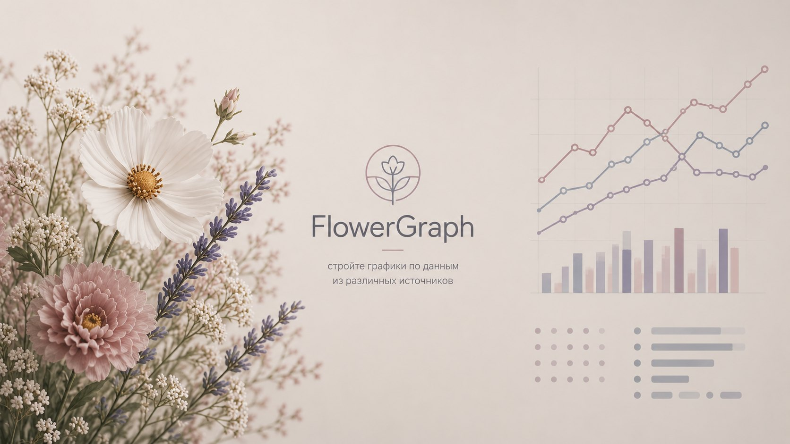
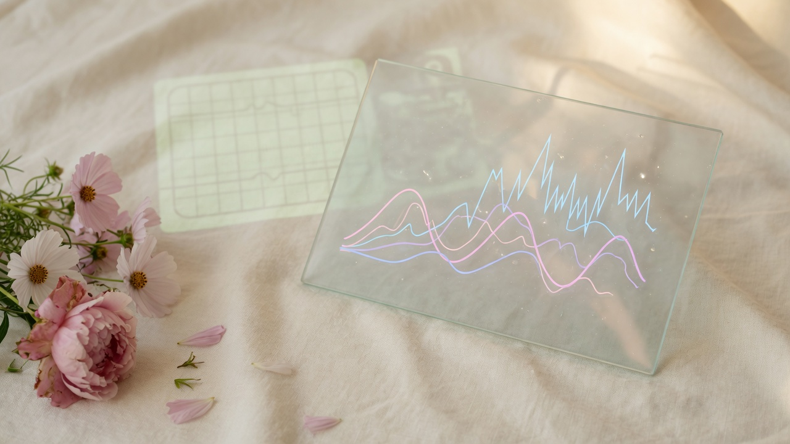
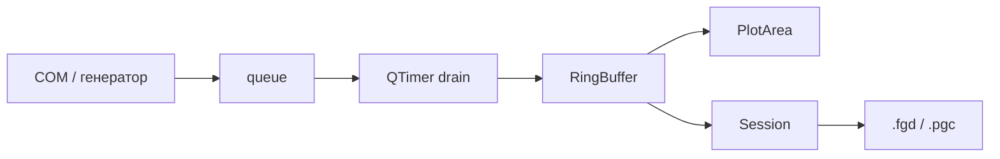

<div align="center">


# FlowerGraph

**стройте графики по данным из различных источников**

Самописец сигналов с COM-порта MCU.  
Live-осциллограф, блоки, калибровка — без MATLAB и без PowerGraph.

<br>


<br>

[Запуск](#запуск) ·
[Возможности](#возможности) ·
[Протоколы](#протоколы) ·
[Сборка](#сборка) ·
[Протоколы MCU](install/FlowerGraph_Protocols.md)

</div>

---

<div align="center">

</div>

---

## Зачем

На стенде есть CH32 / STM32 и UART. Нужен график **сейчас**, а не через скрипт.

| Было | Стало |
|:-----|:------|
| PowerGraph — платный, ASCII конца нулевых | FlowerGraph — ASCII + **COBS / mCOBS** |
| MATLAB / Python-скрипт на каждый эксперимент | Окно, запись, блоки, маркеры |
| Нет живого потока с CRC | Кадр, CRC-16, счётчик потерь |

<div align="center">

</div>

---

## Возможности

| | | |
|:--|:--|:--|
| **Live + запись** | Следящий график, кольцо ~300k точек | Стрим на диск, RAM не раздувается |
| **4 источника** | Генератор, COM ASCII, COM COBS, COM mCOBS | Стенд или проверка UI без железа |
| **Шкала 1–2–5** | Время и амплитуда как на приборе | Маркеры, LOD min/max |
| **Блоки** | Несколько дублей в одной сессии | Калибровка `.cal` |
| **Файлы** | Свой `.fgd` (zip + npy) | Импорт / экспорт PowerGraph `.pgc`, CSV |

---

## Протоколы

MCU шлёт UART — FlowerGraph рисует.

```
MCU ── UART ──►  FlowerGraph
                   ├─ ASCII    ±DDDDD.D + CR     как PowerGraph
                   ├─ COBS     int16…float32     CRC-16, потери пакетов
                   └─ mCOBS    пачка семплов     выше FPS
```

| Протокол | Пакет | На 460 800, 4 канала |
|:---------|:------|:---------------------|
| **ASCII** | 8 байт/канал + CR | ~1 400 семпл/с |
| **COBS** | бинарный кадр + CRC | плотнее ASCII |
| **mCOBS** | batch COBS | ещё выше FPS |

C-код под CH32V303 / CH32V307: **[FlowerGraph_Protocols.md](install/FlowerGraph_Protocols.md)**

---

## Запуск

Портатив **Windows 10 / 11 x64**. Python не нужен.

```
FlowerGraph/
├── Запуск.bat
├── FlowerGraph.exe
└── _internal/          ← не удалять
```

1. Распаковать portable zip
2. Открыть папку `FlowerGraph`
3. `Запуск.bat` или `FlowerGraph.exe`

Win10 1809+ / Win11, x64. SmartScreen на PyInstaller onedir иногда ругается — ложное срабатывание.

Linux portable собирает workflow [Build Linux Portable](https://github.com/mamkincoderr/FlowerGraph/actions).

---

## Сборка

```bat
git clone https://github.com/mamkincoderr/FlowerGraph.git
cd FlowerGraph
setup_venv.bat
.venv\Scripts\python.exe main.py
```

Свой exe: `install\build.bat` (Python 3.11, PyInstaller; Inno Setup — опционально).

---

## Как устроено



Поток читает порт. В виджеты данные попадают только из Qt.

| Слой | Стек |
|:-----|:-----|
| GUI | PySide6, pyqtgraph |
| Данные | numpy `float64` время / `float32` значения |
| COM | pyserial, кадры в фоне |
| Сессия | zip JSON + npy |

```
main.py          точка входа
core/            сессия, кольцо, .fgd
plugins/         источники, PowerGraph I/O
ui/              окно, график, панели
install/         Inno, протоколы, build.bat
assets/          сплэш, иконка
```

---

<div align="center">

**FlowerGraph** v0.6.3.2 · ELEKS

[Исходники](https://github.com/mamkincoderr/FlowerGraph)
·
[Релизы Linux](https://github.com/mamkincoderr/FlowerGraph-releases)
·
[Протоколы](install/FlowerGraph_Protocols.md)

</div>
